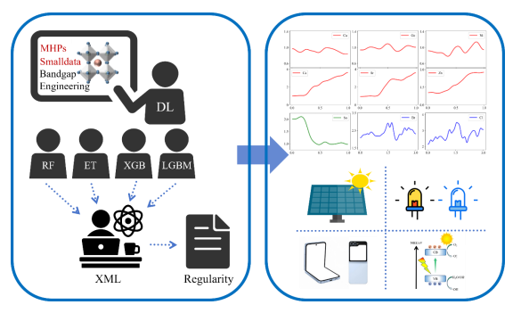

This work:
1. A knowledge transfer framework between complex and simple models frees us from dependence on raw data from metal halide perovskites.
2. The prediction fidelity and model transparency are balanced, resolving the trade-off between complexity and interpretability in traditional strategies.
3. A rational design paradigm for bandgap engineering through interpretative analysis and validation are proposed.

Notes: